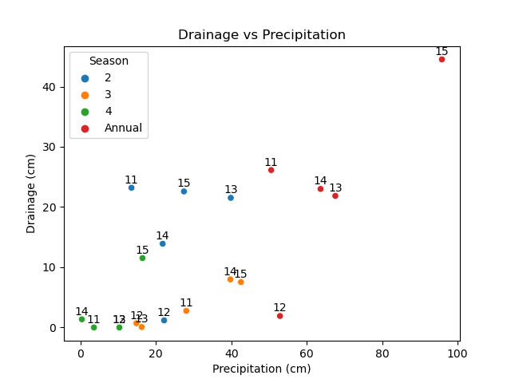

# Does poly coated urea fertilizer application reduce nitrate loss from tile drainage?

# Background

## What is tile drainage?

## Where is tile drainage implemented?

## What are the pros and cons of tile drainage?

From Castellano et al., 2019


From Des Moines Register

From Newsweek
## How do we address the cons?
#### In response to EPA's 2008 Gulf Hypoxia Plan, the Iowa Nutrient Reduction Strategy calls to reduce non-point source total nitrogen load leaving Iowa by 42%
#### Here are some strategies:

## Research question and experimental design
### Does poly coated urea fertilizer application reduce nitrate loss from tile drainage?

### Data from Gilmore City, IA drainage plots 2011-2015

- Experiment included three fertilizer treatments:
  - 150 lb/ac poly-coated urea
  - 150 lb/ac urea
  - 150 lb/ac aqua ammonia
- Four replications of each treatment each year.
- Volume and nitrate-N concentration of drainage flow measured throughout study period.
- Measurements summarized by year and season
  - Season 2: March-May
  - Season 3: June-August
  - Season 4: September-November
- Plot nitrate-N loads calculated from volume and concentration measurements.
- **Flow-weighted nitrate-N concentrations compared between treatments**

> **Note on drainage water quality data:**
>
> Load (kg/ha) = concentration (mg/L) * volume (cm/ha) 
>
> Flow-weighted concentration (mg/L) = total load (kg/ha) / total drainage volume (cm/ha) 
>
> Using flow-weighted nitrate concentration allows for effective treatment comparison that accounts for drainage volume differences between plots

# Specific research questions for this analysis

#### Can we predict the nitrate load in tile drain flow given drainage volume and fertilization method?

#### How does the time of year affect this prediction?

#### Does poly coated urea fertilizer application result in lower flow-weighted nitrate concentrations in drain flow than the other fertilizers?


# Data preparation and cleaning

### Precipitation data needs to be assessed to validate/explain trends in drainage flow

* An onsite rain gauge records hourly precipitation totals.
* Annual data are stored in a .csv file
* Individual precipitation files need to be concatenated
* NAs, duplicate rows, and erroneous data needs to be filtered:

```
# Drop duplicated rows
filtered_weather = weather.drop_duplicates(subset=["TIMESTAMP"], inplace=True) 
# Drop rows with NAs
filtered_weather = weather.dropna()
# Drop header rows that were concatenated
filtered_weather = weather[~weather.isin(['TIMESTAMP', 'TS'])].dropna()
# View sorted rainfall column to check for suspiciously large values
filtered_weather = filtered_weather.sort_values(by='Rain_in_Tot_in', ascending=False)
print(filtered_weather)
```

* Convert from in to cm
* Obtain daily precipitation values and cumulative annual precipitation values

```
# Convert from in to cm
filtered_weather['Rain (cm)'] = filtered_weather['Rain_in_Tot_in'] * 2.54
# Make TIMESTAMP a datetime index
filtered_weather['datetime'] = pd.to_datetime(filtered_weather['TIMESTAMP'])
filtered_weather.set_index('datetime', inplace=True)
# Resample for daily values
daily_rain = filtered_weather['Rain (cm)'].resample('D').sum()
# Create a column for cumulative annual precip
daily_rain['annual_cum_rain'] = daily_weather.groupby(daily_weather['date'].dt.year)['daily_tot_rain_cm'].cumsum()
```

* Visualize precipitation over the study period


### Compare precipitation and drainage data to validate drainage data and identify unique drainage periods
* Calculate seasonal precipitation totals

```
# Calculate monthly precip values, then find seasonal precip values
monthly_data = filtered_weather.resample('M').sum()
monthly_data['season'] = pd.cut(monthly_data.index.month, 
                                bins=[2, 5, 8, 11],
                                labels=['2', '3', '4'])
                                
# Group by year and season and calculate cumulative rainfall
seasonal_data = monthly_data.groupby([monthly_data.index.year, monthly_data['season']])['Rain (cm)'].sum().reset_index()
annual_data = monthly_data.groupby(monthly_data.index.year)['Rain (cm)'].sum()

annual_seasons = pd.DataFrame({
    'Rain (cm)': annual_data.values,
    'season': 'Annual', 'date' : annual_data.index
}, index=annual_data.index)

# Concatenate annual data to seasonal data
seasonal_data = pd.concat([seasonal_data, annual_seasons]).reset_index(drop=True)
```

* Load in drainage dataset and find median seasonal drainage totals for all plots

```
ESNdf = pd.read_csv('../ABE516/ESN.csv', sep = ',')
ESN_seasonal_sub = ESNdf.groupby(['Year','Season']).median()['Drainage'].reset_index()
```

* Qualitatively verify agreement between precipitation and drainage data


* Identify unique drainage seasons - 2012 Season 2 (low drainage); 2015 Season 4 (high drainage)

# Visualize the drainage dataset

* Distribution of drainage volume by season


* Distribution of nitrate load by season


* Distribution of flow-weighted nitrate-N concentration by season


* Median values for each treatment and season combination


* Distribution of flow-weighted nitrate-N concentrations for each treatment by season


* Relationship of nitrate load vs drainage

- Slope (x10) = Flow-weighted concentration (mg/L)

> **Note on drainage water quality data:**
>
> Load (kg/ha) = concentration (mg/L) * volume (cm/ha) 
>
> Flow-weighted concentration (mg/L) = total load (kg/ha) / total drainage volume (cm/ha) 


# Linear regression
### From the load vs drainage figure above, we see a linear relationship between the two variable (to be expected).
### Let's test the strength of the linear relationship and see if there are differences between treatments

* The assumption of homoscedasticity is in question, first we analyze a residual plot for the ordinary least squares model of load vs drainage


* Since the homoscedasticty assumption appears to be violated, we proceed with the generalized least squares regression model

> Aqua-ammonia is shortened to NH4
> 
> Poly-coated urea is shortened to Poly

* Linear regression results for annual nitrate load vs drainage for each treatment:

#### Poly coated urea


#### Urea


#### Ammonia


#### Poly has a lower slope than the other treatments

#### Further, all treatment and season combinations show a strong linear relationship (p<0.05, R-squared>0.85)

#### However, slopes (flow-weighted nitrate-N concentrations) vary slightly


### Does the relationship change during abnormal drainage conditions?
### 2012 Season 2 (Low drainage)
* No apparent effect of poly coated urea


### 2015 Season 4 (High drainage)
* No apparent effect of poly coated urea


# Resampling - Hacker statistics
### The treatments are not evenly balanced in flow-weighted nitrate-N concentration
  - When there is no drainage, it isn't possible to calculate
  - Replacing these NAs with zeros would be wrong as it would skew the dataset towards zero, so they must be dropped

### Also, distriubtions are not perfectly normal


### Bootstrap 10,000 replicates to find a 95% confidence interval for the annual mean flow-weighted nitrate-N concentration of each treatment

```
# Function to draw bootstrap replicates with 3 inputs: sample data, function to calculate statistic, number of replicates
def draw_bs_reps(data, func, size = 1):
    """Draw Bootstrap replicates"""
    
    # Initialize an empty array of for Bootstrap replicates: bs_replicates
    bs_replicates = np.empty(size)
    
    # Generate replicates
    for i in range(size):
        bs_replicates[i] = bs_replicate_1d(data, func)
        
    return(bs_replicates)
```

```
bs_conc_poly = draw_bs_reps(conc_poly, np.mean, size = 10000)
bs_conc_urea = draw_bs_reps(conc_urea, np.mean, size = 10000)
bs_conc_nh4 = draw_bs_reps(conc_nh4, np.mean, size = 10000)
```

* Poly annual mean flow-weighted nitrate-N concentration (mg/L) = [14.11988072, 15.69251087]
* Urea annual mean flow-weighted nitrate-N concentration (mg/L) = [16.4064303 , 18.40347965]
* NH4 annual mean flow-weighted nitrate-N concentration (mg/L) = [15.49219447, 17.03865261]

### Perform permutation tests

#### Ho: The mean annual flow-weighted nitrate-N concentrations are the same between poly coated urea and urea or aqua ammonia
#### Ha: The mean annual flow-weighted nitrate-N concentration is less with poly coated urea than with urea or aqua ammonia

```
# A function to generate permutation statistic replicates
def draw_permutation_reps(data1, data2, func, size = 1):
    '''Generate permutation statistic replicates of given size'''
    
    # Initiate an empty permutation array 
    perm_reps = np.empty(size)
    
    for i in range(size):
        
        # Generate a pair of permutation sample with given array
        perm_sample_1, perm_sample_2 = permutation_sample(data1, data2)
        
        # calculate test statistic using the input func
        perm_reps[i] = func(perm_sample_1, perm_sample_2)
        
    return(perm_reps)
```

```
def mean_diff(arr1, arr2):
    diff = np.mean(arr2) - np.mean(arr1)
    return(diff)
```

Poly vs urea:

```
# Generate permutation replicates: perm_reps
perm_reps = draw_permutation_reps(conc_poly, conc_urea, mean_diff, size=10000)

# Calculate observed test statistic from `conc_poly` and `conc_urea` arrays: diff_obs
diff_obs = mean_diff(conc_poly, conc_urea)

# Compute and print p-value
p_val = np.sum(perm_reps > diff_obs) / 10000
print('p =', p_val)
```

#### p = 0.0002
#### We reject the null hypothesis that mean annual flow-weighted nitrate-N concentrations are the same between poly and urea and conclude that poly has lower mean annual flow-weighted nitrate-N concentration than urea.

Poly vs ammonia:

```
# Generate permutation replicates: perm_reps
perm_reps = draw_permutation_reps(conc_poly, conc_nh4, mean_diff, size=10000)

# Calculate observed test statistic from `conc_poly` and `conc_nh4` arrays: diff_obs
diff_obs = mean_diff(conc_poly, conc_nh4)

# Compute and print p-value
p_val = np.sum(perm_reps > diff_obs) / 10000
print('p =', p_val)
```

#### p = 0.0078
#### We reject the null hypothesis that mean annual flow-weighted nitrate-N concentrations are the same between poly and ammonia and conclude that poly has lower mean annual flow-weighted nitrate-N concentration than ammonia.

### Alternative, potentially stronger or more appropriate statistical methods should be explored to answe this research question. Additionally, it may be useful to break treatments into corn and soybean years to test any potential effects.

# Discussion
### Class topics incorporated into this project:
#### Data cleaning strategies
#### Data visualization strategies
#### Linear regression
#### Resampling-based statistics
#### Version control

  The dataset used in this project can be broken down and analyzed in many different subsets. Data cleaning and visualization strategies make data intrepretation easier and help narrow the focus to what is most significant. Using linear regression and resampling-based statistics can aid in making statistical conclusions about the different fertilizer treatments and their impacts on drainage nitrogen export. Version control aids in optimizing data analysis and providing checkpoints to reference.

  To perfrom the linear regression, independence, normality, and homoscedasticity assumptions were to be met. While indpendence and normality conditions were adequate, homoscedacicity was violated. Thus, a generalized model was used which does not require homoscedasticity as strictly as the ordinary model. Resampling also helped in meeting assumptions for hypothesis testing by creating new datasets of equal sizes that are normal and homoscedastic.
  
  This project follows the FAIR principles by having data and scripts published to Github. Moreover, including rich metadata and comments for coding and analysis decisions helps other data scientists be able to understand reproduce this work. However, being a novice Python coder, much of the code could definitely be made more reproducible and parsimonious.  
